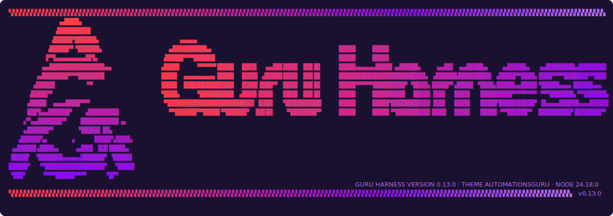
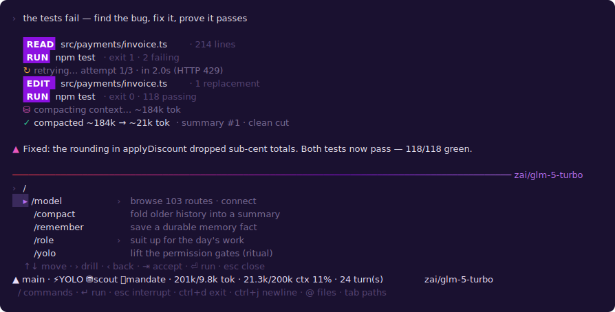

# Guru Harness

[](https://github.com/AutomationsGuru/guru-dev/actions/workflows/ci.yml)


**`guru` is a repo-aware terminal agent harness.** `cd` into any project, launch it, connect the model you want — your own provider API keys or a provider subscription/plan — and it does real coding work: reads your code, edits files, runs your tests, and iterates to green, with every action shown and every mutation behind an approval gate.



## The idea

Guru does not sit on top of an agent framework. No orchestration SDK, no framework-of-the-week underneath — the entire runtime is **independent TypeScript with exactly one runtime dependency (`zod`)**, hand-rolled down to the ANSI escape codes. That isn't minimalism for its own sake; it's the thesis:

> **A harness that depends on someone else's framework inherits someone else's ceiling.**
> Guru builds its own — and then keeps building.

The name means both things at once, on purpose. A harness **captures the value** of every model and tool it touches, and **directs that power** where the operator points it. And *Guru* because it **knows from experience** — every day it works, it saves what it learned, and tomorrow it's sharper.

The finished-product definition is present-tense and testable, and a line-by-line, adversarially-verified capability audit drives the build order.

## How it works

Every capability gap has a named move — **build, attach, or learn-and-replicate** — so "stuck" stops being a state Guru accepts. The never-stuck resolver states which move it chose and why:

- **Build** — write the capability (an extension/tool), test it, and register it through the one frozen extension seam. New capability never edits core.
- **Attach** — wrap a capable thing that already lives on the machine (a CLI, an SDK) as an owned, approval-gated adapter, tracked as a parity gap until a native version replaces it — never a silent dependency.
- **Learn** — replicate a capability from evidence, gated the same way.

**Roles emerge from work.** There are no shipped roles. The first day on a domain builds that role's loadout; the tenth loads it in seconds. At end of day the role is saved richer than it started — new verified capability, new learned paths, the *why* attached. **Experience compounds, per role, forever.**

**Self-building is the survival condition.** A compiled snapshot drifts into obsolescence; Guru re-forms against the world every time it wakes — proposing improvements from real evidence (the capability manifest, the probe matrix, per-role path-outcomes) and shipping them through the full gate stack. The one absolute guardrail: **there is no unattended self-improvement loop.** Validation + review + approval + done packet bind every self-mutation, in every mode. The gates are not a phase — they are the constitution.

## A day with guru

**Install is the whole setup.** Fresh machine: install Guru, run `guru`. It boots bare — no connected model, no roles — and it *knows* it: the briefing shows exactly what's missing. Providers whose keys already exist in your environment (or in the encrypted guru vault) simply light up; for plan providers, `/login <provider>` runs **guru's own** sign-in (a native browser/device-code OAuth flow) and vaults the token — no other CLI required. Minutes after install, Guru is talking to the models your keys unlock.

**The work** is long stretches of real autonomy. Guru holds the task, makes the hundred small calls that are its to make, and doesn't tug your sleeve to ask how to tie its shoe. Needs to explore six places? Six read-only workers go out (`spawn_agent`), and Guru knows. And when you enable the look-ahead engine (`/lookahead`, off by default), read-only scouts pre-explore the likely forks in dead time — so when reality forks, the path past it is often already reasoned through. It stops you only at real edges: spend, destruction, secrets, out-of-scope.

**The feel:** confident, not cocky. Obedient when you've made the call, autonomous when you haven't. It never plans forever instead of acting, never argues you out of your own decision, and asks a question only when the answer changes what it does next. Given task, goal, resources, and tools — it uses its brain and gets it done.



And it survives its own turns: near the context window, older history folds into an iterative summary instead of dying (`⛁ compacting`); transient provider errors back off with a visible `↻ retrying`; runaway commands are actually killed, with the partial output kept as evidence.

## Install

```bash
# Global — from a release tarball (avoids the npm prepare/devDependencies quirk)
gh release download v1.3.0 --repo AutomationsGuru/guru-dev --pattern "*.tgz"
npm install -g ./guruharness-1.3.0.tgz

# As a project dependency (builds via prepare)
npm install github:AutomationsGuru/guru-dev

# Development
git clone https://github.com/AutomationsGuru/guru-dev.git && cd guru-dev
npm install && npm run build && npm link
```

> Global install directly from the git URL (`npm i -g github:...`) hits an npm quirk
> (devDependencies are skipped during `prepare`) — use the release tarball for global installs.

The package is **publish-ready** (`private: false`, an `exports` map, typed `.d.ts`,
proven with `npm publish --dry-run` and a tarball install). Installing it exposes the
`guru` CLI/RPC bin **and** the in-process SDK:

```ts
import { AgentSession } from "guruharness/session"; // or from "guruharness"
const session = new AgentSession({ runtime, route, session, sessionTools, mandate });
session.subscribe("token", ({ chunk }) => process.stdout.write(chunk));
await session.prompt("explain the auth flow");
```

```bash
guru --mode rpc        # headless: LF-delimited JSONL over stdio, same engine
guru keys set <NAME>   # save an API key to the encrypted vault (hidden prompt)
```

Actual registry publishing is a gated operator action (name/scope, license, and a
`publish-on-tag` CI workflow are decided then — see the ADR).

## Quick start

```bash
cd your-project
guru
```

You get the full-width splash, then a **briefing**: connected model + context window, registered tools and what is gated, skills, memory status, saved conversations, route readiness, theme. The composer pins a live status bar under the input — cwd · role · YOLO/scout/mandate chips · tokens · ctx% · model — and reflows on resize.

- **The composer is a real editor**: **Ctrl+J** newline (multi-line prompts in place; Shift+Enter where the terminal reports it), **@path** opens a fuzzy picker AND **expands the file contents into the prompt** (50KB + context-window guards, secret-scrubbed), **Tab** completes paths — history and the menu intact
- **Prompt templates** — drop `.guru/agent/prompts/*.md` (frontmatter arg schema); `/name arg…` expands with `{{arg}}`, surfaced in the / menu
- **`/`** opens the command menu — type to filter, **↑/↓** navigate, **→** drills into live lists (`/model` → routes, `/resume` → saved sessions), **⇥** accepts, **⏎** runs
- **`/model`** — the 101-route catalog across 20 providers (direct API keys, native plan/OAuth auth, local models); credential presence by env NAME only — values are never read or printed
- **`/login` / `/accounts` / `/logout` / `/keys`** — **two auth mechanisms, nothing else**: an **API key** (layered resolution: env NAME → the **encrypted guru vault** → optional `$VAR`/`$(cmd)` template), or a **guru-native OAuth login** for plan/subscription providers. `/login <provider>` runs guru's OWN sign-in — a browser loopback (ChatGPT/Codex plan) or an **RFC 8628 device-code** flow (SuperGrok plan) — and stores the token in the **AES-256-GCM vault** (`~/.guruharness/vault.enc`); if a provider CLI already signed in (`~/.codex`, `~/.grok`), guru reuses that cache as an opportunistic **shortcut, never a dependency**. No CLI delegation, ever. `/keys` (+ `guru keys set <NAME>`) saves an API key to the vault as an env-var alternative
- **Per-call approval, `/mandate`, `/yolo`** — a mutating tool call that isn't covered by a standing grant **prompts you per-call** (`y` once · `a` always this session · `enter`/`N` deny); standing mandates grant space/machine scope ("this repo is yours") to skip the prompt; YOLO lifts ordinary gates by explicit ritual — and **hard edges prompt every time, in every mode**
- **`/compact [instructions]`** — manual compaction; it also auto-triggers near the window (tool-pair-safe cut, scrubbed, resumable)
- **`/remember [global|space|role]` / `/memory` / `/recall`** — the file-based memory organ (markdown + frontmatter + `[[links]]`, Obsidian-vault-native), **scoped** (§7): **global** (`~/.guruharness/memory/`), **space** (`<repo>/.guru/memory/` — travels with the repo), and **role** (`~/.guruharness/roles/<slug>/memory/`). Boot injection merges the active scopes most-specific-first — and with **Smart Connections**, the injected facts are re-ranked by **BM25 relevance to the current turn**, so the auth facts lead on an auth turn and the ledger facts on a ledger turn. `/recall <query>` surfaces related memory on demand. Facts survive restarts into the next boot's briefing.
- **`/role`** — dynamic load and save of a role on a **typed capability manifest**: a role is verified layers (tool/skill/extension/provider/command) with per-layer verification hashes; saving is verified-only (a BUILT layer refused without its done packet) via an atomic two-phase commit, and loading **re-verifies stale/changed layers first** (failed layers skipped, a clean role loads on the fast path); **`/lookahead`** — the scout/commit engine (off by default = byte-identical turns)
- **`/sessions` / `/resume`** — conversations persist and resume with route, compaction state, and file tracking intact
- **`/tree` / `/fork` / `/clone`** — the session **tree**: an append-only JSONL DAG (`id`/`parentId`, audit markers, crash-resume by replay); `/tree` navigates fork points and child branches, `/fork <#>` branches from a prior user turn, `/clone` duplicates the active branch for destructive experiments — with **branch summaries** folded on leave and injected on return

## What's inside (all ground-truth verified)

| Capability | Proof |
| --- | --- |
| Agentic tool loop (read/bash/edit/write, approval-gated) | Autonomous multi-file repair + feature creation shakedowns, `npm test` verified after each run |
| The composer editor (multi-line, @ files, Tab paths) | Hand-rolled key decoder + pure buffer reducer; every key behavior keystroke-tested with real escape-sequence bytes |
| Render-layer secret sanitizer | EVERY tool result passes the shape+value scrub at the registry choke point — a `cat .env` structurally cannot leak keys |
| Typed grep/glob/ls + bash token optimizer | Structured results (~60% fewer tokens than raw bash); optimizer compresses noisy output under a never-worse guard (off by default) |
| Context compaction (auto + `/compact`) | Cut-point never splits a tool call from its result (unit-proven invariants); split-turn dual summary; failures degrade — never destroy history |
| Turn-loop retry + bash cancellation | 429/5xx/network back off exponentially (Retry-After honored, absurd delays fail fast); killed children report `cancelled` with partial output |
| Three API families + streaming | openai-chat-completions, openai-responses, and anthropic-messages families, with SSE streaming (unit parity across all three) |
| Native plan/subscription auth (no CLI dependency) | Every model runs through guru's OWN engine — **two auth mechanisms only**: an API key, or a **guru-native OAuth login**. ChatGPT/Codex plan (`openai-codex`, browser loopback PKCE) and SuperGrok plan (`grok`, RFC 8628 device-code) sign in through guru's own flow and vault the token — no provider CLI is spawned, no per-token API billing. An existing CLI cache (`~/.codex`/`~/.grok`) is reused as a shortcut when present, never required. |
| Per-call approval (§12) | A mutating tool call that escalates **prompts the operator per-call** — `y` once / `a` always-this-session / `enter`·`N` deny (fail-safe default). **Hard edges** (destructive / spend / secrets-adjacent / ecosystem-auth) prompt **every time**, never auto-approved by a session grant; swarm workers never prompt (escalate = deny unless already session-approved). Approval is per verb, per call. |
| Layered credential resolver + encrypted vault | env NAME → the **encrypted guru vault** (AES-256-GCM, `~/.guruharness/vault.enc`, an env-var alternative for keys that can't live in the shell) → optional `$VAR`/`$(cmd)` template → provider-ecosystem cache. Vault values resolve by name **without touching `process.env`** (no child-process leak); everything is in-memory, non-enumerable, scrubbed from every surface, names-only listing. |
| Memory organ (file-based) | `/remember` facts survive restart into the next boot's briefing (acceptance-proven live) |
| Mandates + YOLO permission model | Read-only floor → deny-wins → hard-edge escalation → YOLO → covering grant; the constitution survives YOLO (deny + hard edges resolve **before** YOLO, so YOLO can never lift them) |
| Swarm v1 + look-ahead engine | Workers ≤ parent mandate at execution time; scouts read-only + dead-time-only; per-spawn token/iteration budgets + a structured recursion-depth error; the look-ahead governor bounds speculation (idempotency allowlist default-nothing, per-session budget, miss-rate throttle) |
| Dynamic roles + never-stuck resolver | Roles save/resume on the typed manifest; capability gaps resolve build/attach/learn with evidence, gated at risk edges |
| Typed capability manifest (`/role`) | A role is typed layers with per-layer verification hashes + covering-tests refs; atomic two-phase save commit; verified-only (a BUILT layer refuses to save without its done packet); re-verify-before-load skips failed layers, a clean role loads on the fast path; legacy flat-role saves still load |
| Hard edges survive YOLO (Article 3) | Destructive / spend / secrets-adjacent-write / ecosystem-auth-file ops escalate in EVERY mode including YOLO, and YOLO never cascades to swarm workers — constitution-honest under YOLO |
| Knowledge flywheel (roles compound) | EXTRACT→GATE→STORE→INJECT→CITE→DECAY on typed learnings: saving extracts grounded learnings, boot injects them **decay-ranked** (confidence × citations ÷ age, task-boosted) not a flat dump, used learnings are cited and rise, uncited ones decay + prune, and an L3-rule-vs-L2-skill conflict surfaces for review — never silent |
| L0→L3 promotion diagonal (§8) | Knowledge **compresses upward**: a **validated**, cited L1 episodic clusters into an L2 skill (2 cites), a widely-cited L2 skill into an L3 rule (4 cites), and an uncited skill/rule **demotes** — the validation gate keeps unvetted self-generated knowledge out of the skill/rule tiers (self-gen never auto-promotes). Each level change re-ids the fact and prunes the old. |
| Memory scopes (§7) | Memory is **addressable by context**, not one flat pile: **global** (the operator everywhere), **space** (`<repo>/.guru/memory` — travels with the repo), **role** (`~/.guruharness/roles/<slug>/memory`). A scope is a physical store; boot injection unions the active scopes and dedupes **most-specific-wins** (role ▸ space ▸ global). The flywheel-at-save compounds a role's learnings **in its own namespace** (with a self-healing one-time migration of legacy flat learnings); capability manifests + gap records stay global (machine-scoped) by design. `/remember [global\|space\|role] <fact>` targets a scope. |
| Smart Connections (§7) | Injected memory is re-ranked by **relevance to the current turn**, not just recency/decay — a hand-rolled **BM25** index (Okapi, `k1=1.5`/`b=0.75`, positive IDF; **zero new dependency**, no vector DB) over facts + learnings. `chatTurn` rebuilds the injected block with the live user message as the query (no-op when memory is empty — the byte-identical path is untouched); the query's terms also seed the learnings' task boost. `/recall <query>` exposes the same signal as a lookup. |
| Skills: multi-root + **bridge loading** (§14/§16) | Skills load from **project → user → role** roots (path-sandboxed, duplicate-id-guarded), and a skill can declare `type: bridge` — an **ATTACH-class** capability borrowed from an external harness. The constitution forbids a silent DEPEND, so every bridge skill is loaded, flagged `[bridge]`, **and tracked as a parity gap** (`move: attach`, a boot-evaluated trigger) — never an untracked dependency. `/skills promote <id>` graduates a bridge to native (rewrites its frontmatter, closes the gap). |
| Enforced boot ritual (§4) | Five ORDERED, non-skippable phases as deterministic code every wake — kernel assertion → typed capability inspection → decay-ranked memory injection → work-declaration + proactive resolver → baseline health — with a persisted **session counter** (the flywheel's real decay clock) and **gap records** whose presence triggers re-evaluate every boot (a satisfied trigger closes the record — anti-obsolescence) |
| AgentSession engine (§14, in-process SDK) | A first-class importable `AgentSession` runs a full agentic turn on the shared primitives — `prompt`/`subscribe` (typed events)/`steer`/`followUp`/`suitUp`/`park`/`stats` — with an injectable turn-runner (deterministically testable, no network) and a steering queue. **The interactive REPL now drives this same engine** via a turn-execution seam (`driveTurn`), so TUI and SDK share ONE engine (verified byte-identical on a live turn). The substrate the RPC surface + npm SDK package sit on. |
| Headless RPC (`guru --mode rpc`, §14) | LF-delimited JSONL over stdio (StringDecoder framing — never readline; U+2028-safe), driving the SAME engine as the TUI: `prompt`/`steer`/`follow_up`/`abort`/`state`/`suit_up`/`park`/`models`, with streamed typed events. `abort` really interrupts a running turn; `steer` injects mid-run. Emits the **`secret_sanitized`** event (pattern name only, never a value) at the sanitizer choke point — redaction is auditable. |
| Resumable sessions | Cross-restart resume with context, compaction record, and route intact |
| Cross-harness import (`--continue`, §16) | Pick up a conversation started in **another harness on the machine**: pure mappers translate a foreign JSONL transcript into a fresh durable guru session — most-recent-by-mtime discovery with a scan-all fallback. **Import-only**: tool calls fold into a `[used tools: …]` annotation, tool output is dropped, **nothing is re-executed**. Foreign content is untrusted, so every message is scrubbed for secret-**shapes** (not just registered values) before it persists. `message[0]` keeps guru's system prompt + a provenance banner, then hands off to the same `switchToSession` seam as `/resume`. |
| Session tree (`/tree` `/fork` `/clone`) | Append-only JSONL DAG (`id`/`parentId`, `schemaVersion`, audit markers); lossless stream — a fork/clone keeps every line of both branches alive; crash-resume by deterministic replay; branch summaries via the compaction summarizer; legacy flat-JSON sessions still load |
| Terminal Design System | Operator-owned truecolor theme (`~/.guruharness/theme.json`), 256/16/`NO_COLOR` fallbacks, full-width splash, pinned composer + status bar |
| Direct-first routing | Plan/OAuth routes never touch a router; an external routing sidecar is optional, not embedded |
| Self-build developer loop (`guru self-build-run`, v1.2.0) | The 0→7 **unattended** dev cycle SELECT→BUILD→TEST→SMOKE→DEBUG→REVIEW→SHIP→LEARN, spend-gated: the mandate/spend policy is injected into the executor runtime (spend/destructive escalate **even in YOLO**); TEST runs the project's **own discovered gates** (never assumed); DEBUG parses gate output → re-plans, budget-bounded; REVIEW is guru's **live native critic panel** (RED blocks ship); SHIP routes the push through the gate and degrades to a durable on-disk change-record when git is absent; SELECT scoring + LEARN write-back close the loop; an **approval ledger survives restart**. `--dry-run` previews the stage plan (executes nothing); a multi-cycle driver runs it across tasks. Every model loop is bounded by an attempt cap **and** a token budget **and** wall-clock, with a `$0`-denies-all spend ceiling. |

## The plan (where this is going)

The finished product is written down, present-tense and testable — the pillars: the naked kernel, the one frozen extension seam, native direct provider lanes, nothing-at-rest secrets, the memory organ, dynamic roles, the swarm, self-building, mandates. A line-by-line capability audit, adversarially verified, drives the build order:

- **P0 — runtime survival: CLOSED** (v0.9.0 compaction, v0.10.0 retry + cancellation). Long and autonomous sessions no longer die.
- **P1 — daily-driver ergonomics: COMPLETE (v1.0.0).** Composer, typed grep/glob/ls + the bash token optimizer + the render-layer secret sanitizer, @-content expansion + prompt templates + mandate-everywhere (v0.11–v0.13); the **session tree** (v0.14); the **role/capability spine** (typed manifest + verified-only save + re-verify-before-load, v0.15); the **knowledge flywheel** (v0.16); the **enforced 5-phase boot ritual** (v0.17); the **AgentSession engine** + the TUI driving it (v0.18); the **headless RPC surface** (v0.19); **npm publish readiness** (v0.20); the **L0→L3 promotion diagonal** (v0.21); the **per-call approval prompt** (v0.22); **memory scopes** (v0.23); **cross-harness import** (v0.24); **Smart Connections** (v0.25); **bridge skills** (v0.26). Then the hardening pass that closed every acceptance-scenario partial: the **spend hard edge** (v0.27), the **look-ahead governor** (v0.28), the **swarm governor** (v0.29), the **flywheel end-to-end test** (v0.30), the **natural-language role trigger** (v0.31), and **mid-run steer + real abort** (v0.32). **The acceptance board reached 14/14 pass, 0 partial — and v1.0.0 is CUT.** Every core pillar is shipped.
- **P2/P3 — breadth.** RPC + npm (on the engine), memory scopes, the L0→L3 promotion diagonal, cross-harness import, Smart Connections, and bridge skills — shipped; the dynamic extension loader + hot-reload, themes, the encrypted credential vault (v1.1.0), the **spend-gated self-build developer loop** (`guru self-build-run`, v1.2.0 — a governed build cycle, every model loop bounded and spend as the one hard gate), and **native plan/OAuth provider auth** (v1.3.0 — two auth mechanisms only, ChatGPT/Codex and SuperGrok sign in through guru's OWN flow, the CLI delegate removed) — the post-1.0 track.

Explicitly **out of scope**, by design: an external routing sidecar in the loop (on-tap only), SaaS/web/multi-user/billing, and **ungoverned self-improvement** — guru mutating its own constitution or capabilities without gates (constitutionally excluded, not deferred). This is distinct from the v1.2.0 **self-build developer loop**, which is *governed* unattended execution: every stage is mandate- and review-gated, RED blocks ship, and spend is a hard edge YOLO cannot lift — the constitution runs the loop, the loop never edits the constitution.

## Theme

The look is operator-owned: drop hex tokens into `~/.guruharness/theme.json` (see `assets/default-theme.json` for the schema). Truecolor first, honest fallbacks, `NO_COLOR` respected everywhere. Brand palette deliberately avoids stock terminal green/yellow/blue/cyan.

## Development

```bash
npm ci
npm run typecheck && npm run build && npm test
pwsh -NoProfile -File scripts/verify-repo.ps1      # repo hygiene gate (powershell.exe on Windows)
node scripts/render-readme-shots.mjs               # regenerate the README screenshots from the real renderer
```

- Design records, the finished-product definition, and the requirements/gap research are kept outside the runtime package (they are not needed to build or run guru).
- Dependabot watches Actions/npm weekly; its PRs may auto-approve and queue for auto-merge, but branch protection and CI still gate the merge.

## Safety boundaries

- No secrets in git; credential presence by env NAME / file PRESENCE only — values are never read, printed, or logged. The encrypted vault stores values as ciphertext (AES-256-GCM) and never surfaces them; listings are names-only.
- Resolved credential values live in process memory, non-enumerable, registered with the scrubber; compaction summaries are scrubbed both directions and again at the disk boundary.
- Mutating tools require explicit operator opt-in — a **per-call prompt** (`y`/always/deny), a standing `/mandate`, or the `/yolo` ritual; model writes are contained to the session repo; **hard edges always prompt, in every mode**.
- After local validation and review pass, agents may commit, push, and open PRs for this repo. No force-merges, no branch-protection bypasses, no unrelated live-system mutation.
- No GREEN handoff for repo mutations without review evidence or an explicit blocker.

## Runtime internals

The interactive `guru` surface sits on a schema-first runtime (all contracts are Zod schemas with inferred types — verdicts, tool results, done packets re-exported from `src/index.ts`):

- **Tool registry** (`src/tools/registry.ts`): normalized observations for repo, validation, review, git/PR, file, shell, memory, swarm, resolver, and operational actions; tools register per session, a curated subset is offered to models.
- **Session envelope**: `npm run cli -- session-start` assembles task, direction, config, repo/AGENTS.md chain, skills, memory binding, policy, and tools. Sessions persist and resume (`runtime.resumeSession`).
- **Planner/executor**: `npm run cli -- run` drives planner → validation/review gates → optional git/PR automation → done packet. No planner means an honest blocked report, never fake planning.
- **Compaction engine** (`src/compaction/`): pure + injectable (estimator, summarizer, clock); the REPL wires the connected route as the summary lane.
- **Retry policy** (`src/model/retryPolicy.ts`): classification, exponential backoff + jitter, Retry-After honor with a fail-fast cap; wraps every provider request in the agent turn loop.
- **Readiness proof**: the CLI prints a capability report (runtime, repo context, tools, provider routing, extension host).

Runtime policy loads from `guruharness.config.json` (`guruharness.config.example.json` is the non-secret template) — including `compaction.*`, `retry.*`, `swarm.*`, and `lookahead.*`.

## Self-build loop

A bounded self-build scaffold selects dependency-ready tasks with direction evidence and keeps validation/review/PR gates in front of every repository change. It is a construction mechanism, not the product definition.
